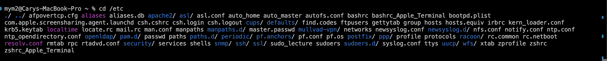
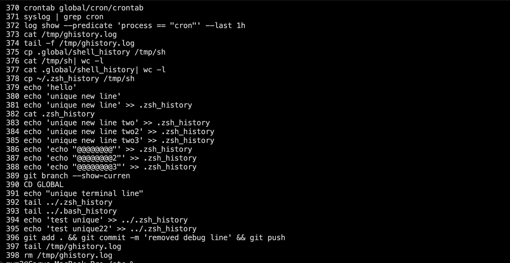
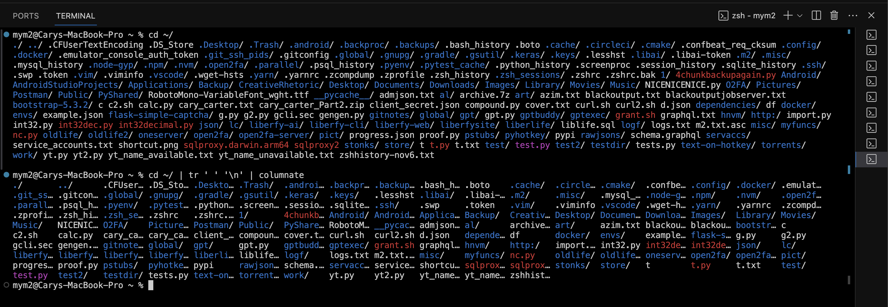

# Global Repo

This is a repo I have cloned in every environment I work in.

The main utility this repo offers is something called "globalshell", which is just a suite of posix compliant shell functions and aliases that I find helpful to have in every environment I work in. Both macos & recent ubuntu distributions are explicitly supported in most circumstances.

## GLOBALSHELL

`init-globalshell.sh` initalizes globalshell and adds initialization logic to the appropriate shell rc file.

`globalshell/aliases.sh` As name implies, contains the aliases loaded into the shell.

## Aliases

Here's a summary of what each alias in your `aliases.sh` file does, formatted in Markdown:

- `gpull`/`gpush`: Pulls/pushes the branch set as $BNAME to/from the remote repository.

- `initgshell`: Sources the `init-globalshell.sh` script from the `global` directory in the user's home directory.

- `pyenvinit`: Initializes `pyenv` on a system with `pyenv` installed. `pyenv` can cause some path weirdness if initialized in the shell rc file.

- `timestamp`: Prints the current time as a Unix timestamp plus milliseconds. Equivalent to python `time.time()`

- `py3` and `py`: Shortcuts for running Python 3 and the default Python interpreter, respectively.

- `git-ssh`: alias for `git_ssh` function which is covered in the functions section.

- `dc`: Shortcut for `docker compose`, a tool for defining and running multi-container Docker applications.

- `dcpruneall`: Removes all unused Docker images, containers, volumes, and networks.

## Commands

### cd

I've overriden the `cd` command with custom functionality which displays a colored and sorted list of file names in whichever dir was the target of `cd`.

Originally I had a sh function that did this, then a python script, then finally I wrote the utility using cpp for optimization reasons. Going from python -> c++ was about a 90% performance improvement.

### history

I've overriden the `history` command with custom functionality which works as follows:

If the `GLOBAL_SHELL_HISTORY` environment variable is set, the `history` command will execute `$HOME/global/cron/ghistory.py` which combines multiple shell history files into a single file, removes any duplicate entries, and displays a list of numbered commands to the user.

One can optionally use `crontab cron/crontab` to set up a cron job to run `ghistory.py` at a regular interval. This will ensure that default shell history file behavior is bypassed (mainly the truncation) and every unique command is preserved.

The default history file location is `$HOME/.global/shell_history`

### Colorprint

This was created to work around issues with in-terminal color lines being broken at incorrect widths. It had to be maximally performant or otherwise it would be annoying to use.

There are two versions of colorprint, one in python and one in c++. There are 2 compiled binaries of the c++ version, one for ARM64 and one for x86-64. The correct version should be automatically used based on system/os type.

`colorprint.py` is the python version of colorprint.

`colorprint-x86` is the x86-64 version of colorprint.

`colorprint-arm` is the ARM64 version of colorprint.

(see the `cd` img for an example of colorprint in action)

### revert_to_commit

- Purpose: Reverts the current Git branch to a specified commit by creating a new branch and reverting commits up to the target.

- Usage: `revert_to_commit <commit_hash>`

### gitconf

- Purpose: Configures Git username and email globally, locally, or system-wide.
- Usage: `gitconf <email> [scope]` or `gitconf [scope] <email>`
- Scope Options: global, local, system.

### gitnewbranch

- Purpose: Creates a new Git branch off a specified base, stashing or resetting local changes as needed.
- Usage: Interactive prompts guide the process.

### gitacpush

- Purpose: Automatically adds, commits, and pushes changes to the current branch without needing to specify a commit message.
- Usage: `gitacpush`

### gitdatecommit

- Purpose: Commits changes with a specific author and committer date.
- Usage: `gitdatecommit [-m <message>] [-d <date>] [-t <time>]`

### **_gptfiles_**

- Purpose: Takes a list of files and copies their contents in a token minimized way onto the clipboard for easy pasting into (usually) chatgpt

- Usage: `gptfiles <file1> <file2> ...`

### git_ssh

- Purpose: Adds a specified SSH key to the SSH agent to facilitate Git operations over SSH. It allows for easy usage of `ssh-add` and can be configured to automatically add a key on startup if the `GIT_SSH_DEFAULT_CHOICE` environment variable is set.
- Usage: `git_ssh` (or `git-ssh` if aliased)

### actvenv

- Purpose: Tries to activate the most relevant Python virtual environment to the current working directory, streamlining the process of switching between projects.
- Usage: `actvenv`

### fixperms

- Purpose: Ensures that all files and directories in the current or provided directory are set to the user's user:group with permissions set to 755, standardizing access rights for security and usability.
- Usage: `fixperms [file/directory]`

### evar

- Purpose: Sets an environment variable in the current session and adds the `export <variable>=<value>` line to the appropriate shell `.rc` file, ensuring the variable's availability in future sessions.
- Usage: `evar <variable_name> <value>`

### safesource

- Purpose: Provides a safe way of calling `source` or `.` (dot command), handling scenarios where `source` is not installed. It ensures scripts or configuration files are sourced correctly across different shells.
- Usage: `safesource <file>`

### substr_in

- Purpose: Checks if a specified substring is present within a string, offering a simple utility for string manipulation or conditional logic.
- Usage: `substr_in <substring> <string>`

### ostype

- Purpose: Detects the operating system type and architecture. This utility is useful for scripts that need to adapt based on the operating environment.
- Usage: `ostype`

### posix_ranstr

- Purpose: Generates a random string of a specified length and character set, which can be used for creating unique identifiers or passwords.
- Usage: `posix_ranstr <length> [<charset>]`

### screenproc

- Purpose: Manages screen sessions, providing functionalities to list, kill, and name sessions automatically. It's particularly useful for managing long-running processes in the background.
- Usage: `screenproc [option]`

### pasterun

- Purpose: Executes a command on code pasted directly into the terminal. This function facilitates the quick testing or execution of scripts without the need for creating a temporary file.
- Usage: `pasterun <command>`

### dirfiles

- Purpose: Lists files and directories within a specified path, applying filters to exclude certain directories by default. It helps in navigating project structures more efficiently.
- Usage: `dirfiles <directory>`

### tstime

- Purpose: Measures the execution time of a specified command in milliseconds, aiding in performance testing and optimization efforts.
- Usage: `tstime <command>`

### columnate

- Purpose: Organizes input into avg/median width truncated columns for easy, compact viewing. Automatically detects terminal width and adjusts the number of columns accordingly, as well as properly handling color codes and special characters.
- Usage: `ls -AaFp --color=always | columnate`

### get_shell_rc_file

- Purpose: Identifies the shell's rc file, such as `.bashrc`, `.zshrc`, etc. This utility supports customizing and configuring the shell environment by determining the correct file to modify.
- Usage: `get_shell_rc_file`

### sourceshell

- Purpose: Sources the identified shell rc file, effectively refreshing the shell's environment and settings. It ensures that any changes to the shell configuration are immediately applied.
- Usage: `sourceshell`
